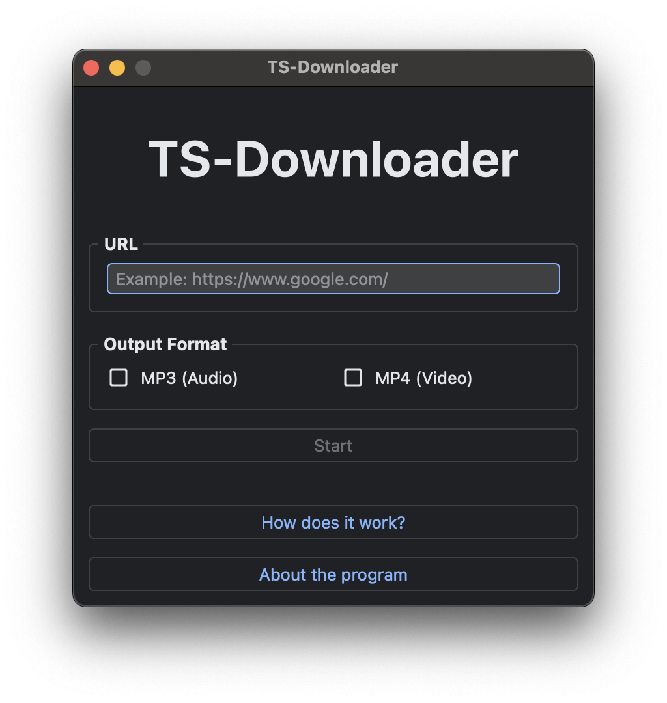
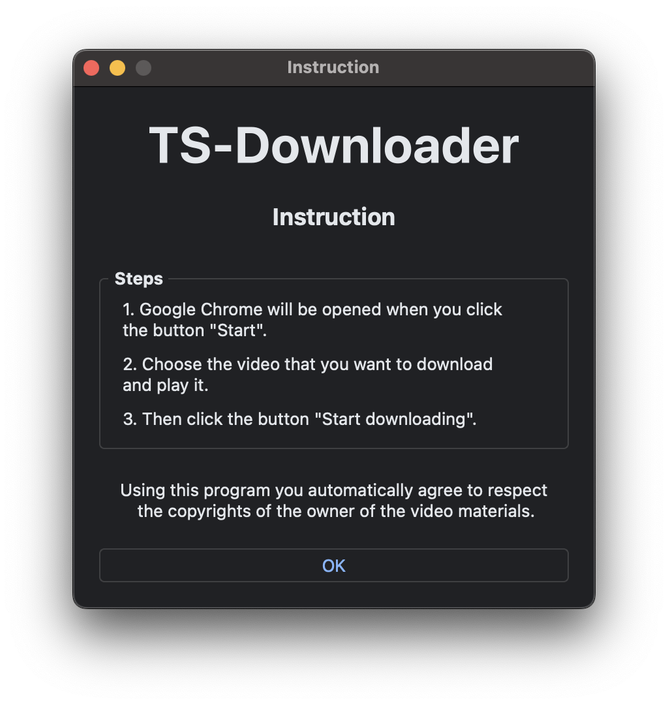
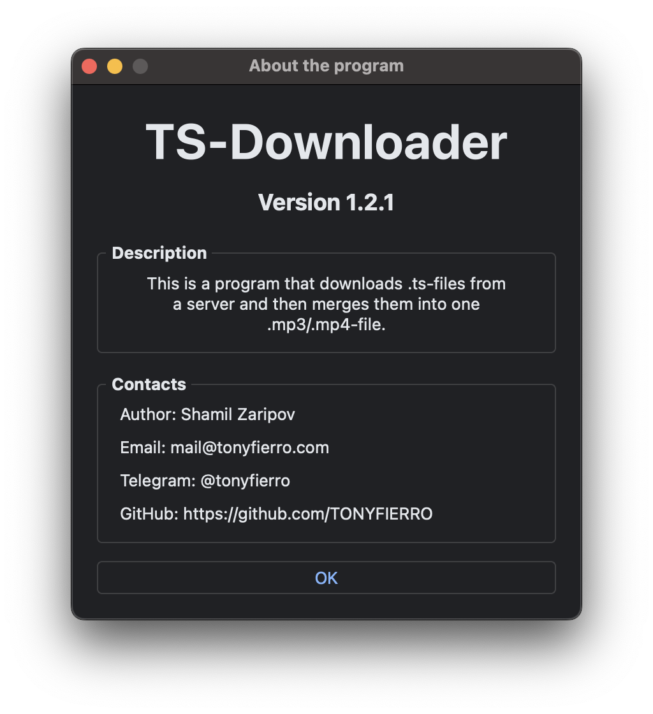

<br>
<br>

```
                          
							░▒▓████████▓▒░▒▓███████▓▒░▒▓███████▓▒░  
						   	   ░▒▓█▓▒░  ░▒▓█▓▒░      ░▒▓█▓▒░░▒▓█▓▒░ 
						       ░▒▓█▓▒░  ░▒▓█▓▒░      ░▒▓█▓▒░░▒▓█▓▒░ 
						       ░▒▓█▓▒░   ░▒▓██████▓▒░░▒▓█▓▒░░▒▓█▓▒░ 
						       ░▒▓█▓▒░         ░▒▓█▓▒░▒▓█▓▒░░▒▓█▓▒░ 
						       ░▒▓█▓▒░         ░▒▓█▓▒░▒▓█▓▒░░▒▓█▓▒░ 
						       ░▒▓█▓▒░  ░▒▓███████▓▒░░▒▓███████▓▒░  
                                        
                                        
  
```

<h4 style="text-align: center;">TS-Downloader (TSD) – is a program that downloads .ts-files from a web-server and then merges them into one .mp3/.mp4-file.</h4>


## Installation

1. Clone the repository. <br>
	```git clone https://github.com/TONYFIERRO/ts-downloader.git``` <br>

2. Install all dependencies that wrote in *Dependencies*. 

3. Then just run *main.py* and that's all.

## Dependencies

1. Python 3.11.
2. Libraries in *requirements.txt*.

## Screenshots



---



---



## TODO

* Import logging.
* Deploy the program for macOS and Windows.

## Licence

The MIT Licence. More detailed in LICENCE file.

## Contacts

Author: Shamil Zaripov <br>
Email: mail@tonyfierro.com <br>
Telegram: @tonyfierro <br>
